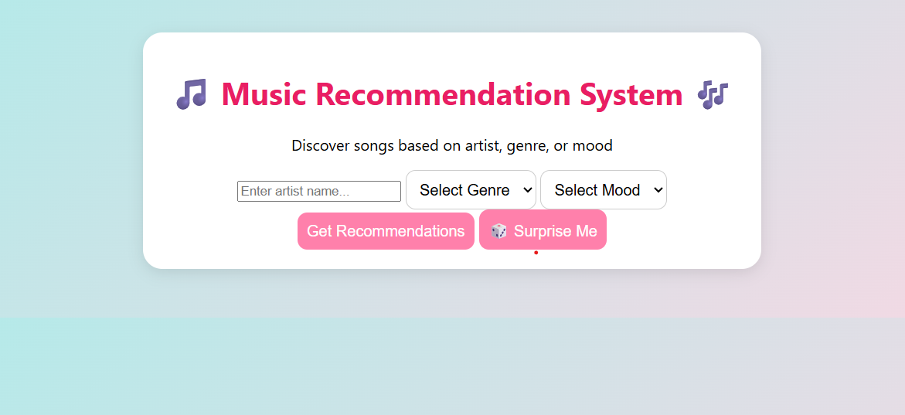
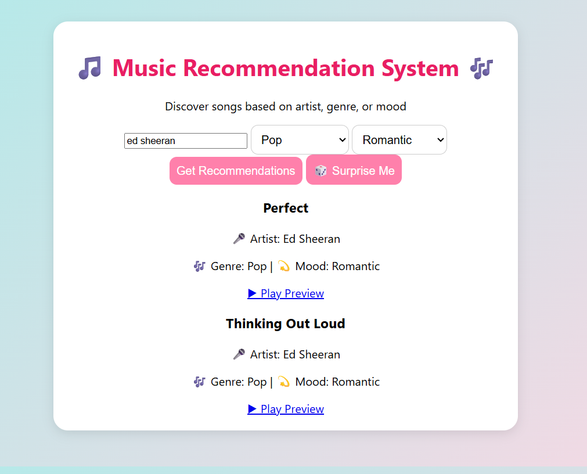
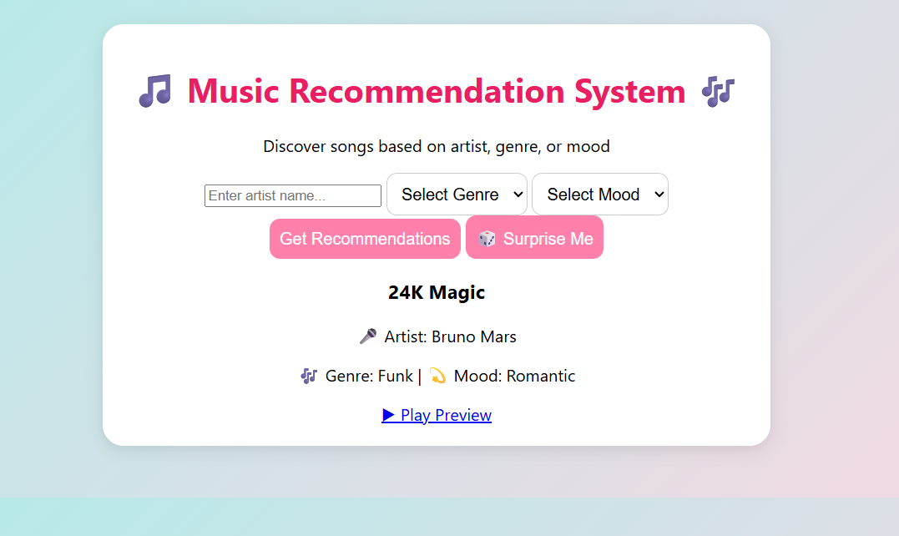

# 🎵 BeatFlow– Music Recommendation System

BeatFlow is a data structures based music recommendation system that efficiently organizes and recommends songs using core computer science concepts such as Trees, Stacks, Queues, and Graph traversal algorithms.

The project demonstrates practical application of theoretical data structures on real-world data stored in JSON format.

---

## 🚀 Features
- Music data stored and managed using JSON files
- Tree-based organization of songs (by genre, artist, or category)
- Song search and recommendation using BFS and DFS
- Stack-based management of recently played songs
- Queue-based playlist and recommendation flow

---

## 🧠 Data Structures Used
- **Tree** – Hierarchical organization of music data
- **Graph Traversals (BFS & DFS)** – Efficient search and recommendation
- **Stack** – Tracks recently played songs
- **Queue** – Manages playlist order

---

## 🛠 Tech Stack
- Programming Language: C / C++ / Python / JavaScript
- Data Format: JSON
- Core Concepts: Data Structures & Algorithms

---

## 📂 Project Structure
data/
└── songs.json
src/
└── recommendation_logic/
README.md

yaml
Copy code

---

## ▶️ How It Works
1. Music data is loaded from JSON files
2. Songs are organized into a tree structure
3. BFS and DFS are used to traverse and recommend songs
4. Stack maintains recently played history
5. Queue handles playlist sequencing

---
## 📸 Screenshots

## 🎯 Learning Outcomes
- Hands-on implementation of Trees, Stacks, and Queues
- Practical use of BFS and DFS algorithms
- Improved understanding of structured data handling
- Strengthened problem-solving and algorithmic skills

---

## 📌 Future Enhancements
- User preference-based recommendations
- Simple UI integration
- Performance optimization
- Advanced filtering options

---

## 📄 License
This project is open-source and available under the MIT License.